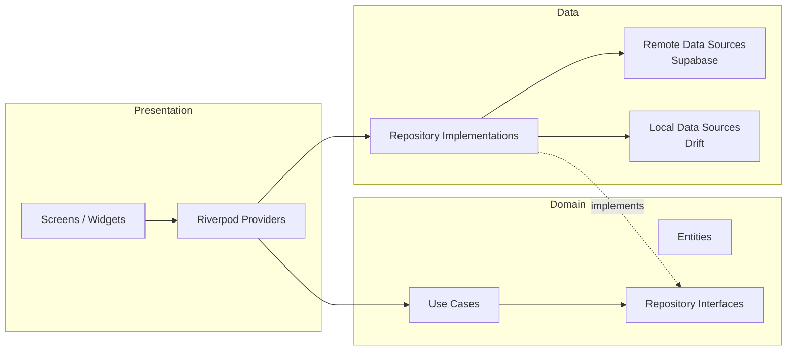
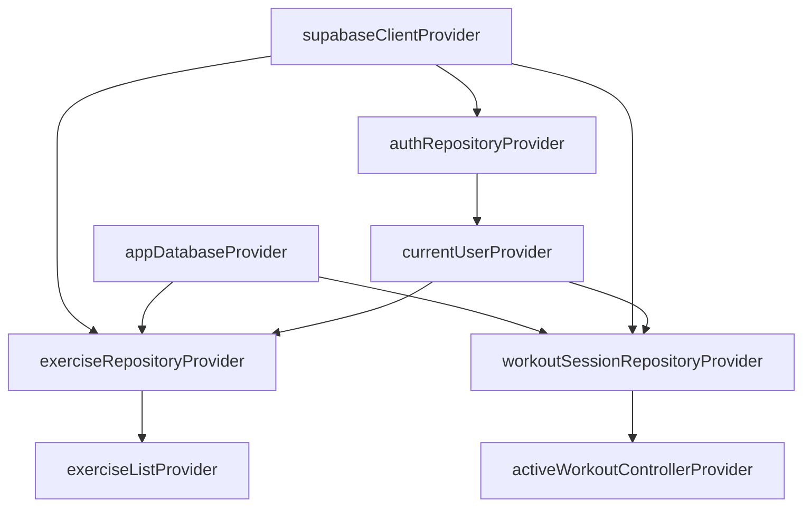
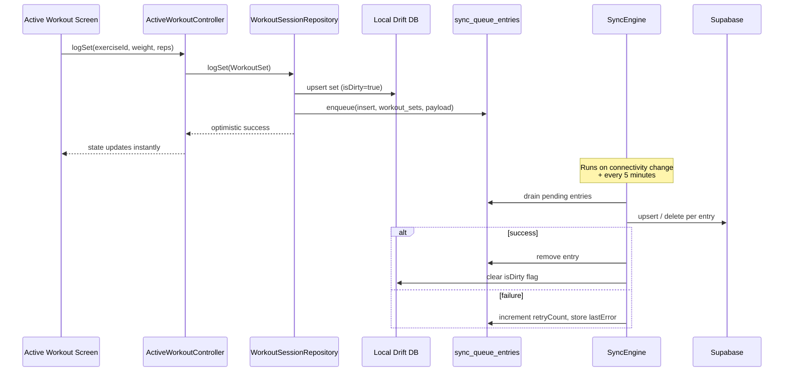
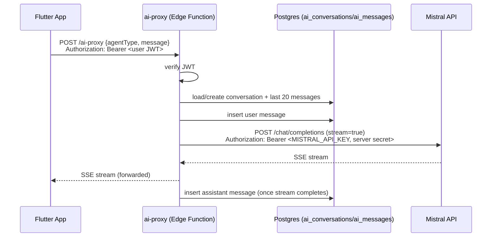

# Architecture

IronCoach follows **Clean Architecture** with a **feature-first** folder
structure. Every feature (`auth`, `workouts`, `nutrition`, `progress`,
`ai_coach`, `gamification`, `social`, `notifications`, `profile`, `home`)
is organized into the same three layers, dependencies pointing inward:

- **Domain** has zero Flutter/Supabase/Drift imports — it's pure Dart
  (entities as `freezed` value types, abstract repository interfaces, and
  use-case classes). This is what makes business logic unit-testable
  without mocking a database or a widget tree.
- **Data** implements each domain repository interface against Supabase
  (`supabase_flutter`) and, for offline-first features, a local Drift
  cache. Low-level exceptions (`PostgrestException`, `AuthException`,
  drift errors) are caught here and mapped to the domain's `Failure` union
  — nothing below `data/` ever leaks a third-party exception type upward.
- **Presentation** is Riverpod providers (`riverpod_generator`, `@riverpod`
  annotations) wiring domain use cases/repositories to widgets, plus the
  screens/widgets themselves (`flutter_hooks` for local widget state where
  it's simpler than a provider).

## Dependency injection

There is no separate DI container — Riverpod's provider graph **is** the
DI mechanism. Every repository is exposed via a `@Riverpod(keepAlive: true)`
provider that constructs it from lower-level providers (the Supabase
client, the Drift database, other repositories). Swapping an implementation
for a test is `ProviderScope(overrides: [...])`.

## Offline-first sync

Two features are offline-first by design: the **exercise library** (read
cache) and **workout logging** (write-behind). Both are backed by a local
Drift SQLite database (`lib/core/local_db/app_database.dart`) plus a
generic outbox table (`sync_queue_entries`) drained by `SyncEngine`
(`lib/core/sync/sync_engine.dart`).

Reads (`getHistory`) try Supabase first to refresh the cache, then always
serve from Drift — so the UI never blocks on network and always has
*something* to show, even offline on first launch after the exercise
library has been cached once.

Other features (nutrition, progress, gamification, social) are simpler
online-first CRUD against Supabase directly, since they're not in the
critical "must work mid-workout with no signal" path.

## AI system

All AI calls are proxied through Supabase Edge Functions — **the Mistral
API key never reaches the client**.

Six specialized agents (`workout_coach`, `nutrition_coach`,
`recovery_coach`, `motivation_coach`, `meal_analysis`, `daily_planner`)
share the same proxy but get distinct system prompts
(`supabase/functions/_shared/agents.ts`) and, for `workout_coach` /
`nutrition_coach` / `recovery_coach` / `motivation_coach`, independent
per-agent conversation memory (one `ai_conversations` row per
`(user_id, agent_type)`). `meal_analysis` and `daily_planner` are one-shot
structured-JSON agents invoked from dedicated Edge Functions
(`meal-analysis`, `daily-planner`) rather than the chat UI.

## Routing

`GoRouter` with a `StatefulShellRoute.indexedStack` for the five bottom-nav
tabs (Home, Workouts, Nutrition, Coach, Profile) so each tab keeps its own
navigation stack. Auth-gated redirect logic lives in one place
(`lib/core/router/app_router.dart`), driven by `authStateStreamProvider`.

## Error handling

Every repository method returns `Result<T>` (`Either<Failure, T>` from
`fpdart`) instead of throwing. `Failure` is a closed `freezed` union
(`network`, `server`, `unauthorized`, `validation`, `notFound`, `cache`,
`conflict`, `rateLimited`, `unexpected`), each with a
`displayMessage` safe to show directly in a `SnackBar`. This keeps error
handling exhaustive and explicit at every call site instead of relying on
uncaught exceptions bubbling through widget trees.

## Testing strategy

- **Unit tests** (`test/unit/`): domain logic with zero Flutter
  dependency — the workout generator's rules, `Failure` message mapping,
  use cases against a mocked repository (`mocktail`).
- **Widget tests** (`test/widget/`): shared widgets in isolation
  (`PrimaryButton`, `EmptyState`, ...).
- **Integration tests** (`integration_test/`): full app boot against a real
  (or local) Supabase project, starting with the unauthenticated golden
  path.
