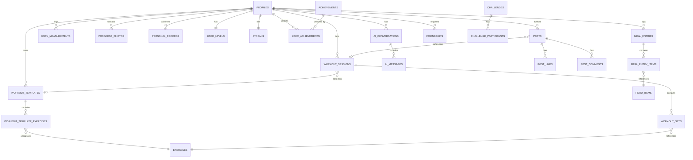

# Database

PostgreSQL via Supabase. Every table lives in the `public` schema, has Row
Level Security **enabled**, and its policies are defined in the same
migration file that creates it (`supabase/migrations/`). Migrations are
numbered and applied in order — see the table below for what each one adds.

| Migration | Adds |
|---|---|
| `20260724000001_extensions_and_helpers.sql` | Extensions, `set_updated_at()` trigger, `are_friends()` stub |
| `20260724000002_profiles.sql` | `profiles`, auto-provision trigger on `auth.users` insert |
| `20260724000003_exercises.sql` | `exercises` (public library), `user_exercises` (custom, private) |
| `20260724000004_workout_templates.sql` | `workout_templates`, `workout_template_exercises` |
| `20260724000005_workout_sessions_sets.sql` | `workout_sessions`, `workout_sets`, volume-recalc trigger |
| `20260724000006_favorites.sql` | `favorite_exercises`, `favorite_templates` |
| `20260724000007_nutrition.sql` | `food_items`, `meal_entries`, `meal_entry_items`, `water_logs`, `nutrition_goals` |
| `20260724000008_progress.sql` | `body_measurements`, `progress_photos`, `personal_records`, PR-recalc trigger |
| `20260724000009_gamification.sql` | `achievements`, `user_achievements`, `user_levels`, `streaks`, `challenges`, `challenge_participants` |
| `20260724000010_social.sql` | `friendships`, `posts`, `post_likes`, `post_comments`, `are_friends()` (real impl), `leaderboard_view` |
| `20260724000011_ai_conversations.sql` | `ai_conversations`, `ai_messages` |
| `20260724000012_notifications.sql` | `notification_preferences`, `ai_insights` |
| `20260724000013_storage_buckets.sql` | `avatars`, `meal-photos`, `progress-photos`, `post-media` buckets + object policies |
| `20260724000014_realtime.sql` | Realtime publication for live-updated tables |
| `20260724000015_seed_reference_data.sql` | Starter exercise library + achievement definitions |
| `20260724000016_gamification_triggers.sql` | `award_xp`, `bump_streak`, `check_and_unlock_achievements`, wired to `workout_sessions` triggers |

## Entity-relationship diagram

## Row Level Security patterns

Three patterns cover nearly every table:

1. **Strictly private** (`workout_sessions`, `meal_entries`,
   `body_measurements`, `notification_preferences`, ...): `using (auth.uid() = user_id)`
   on every operation.
2. **Public reference data, admin-only writes** (`exercises`,
   `achievements`): `select` open to `authenticated`, mutations restricted
   to `service_role`.
3. **Owner + friends/public** (`posts`, `post-media` storage objects):
   `using (auth.uid() = user_id or are_friends(auth.uid(), user_id) or <profile is public>)`,
   via the `are_friends()` SQL function defined in the social migration.

## Server-side automation

Two trigger-driven subsystems run entirely in Postgres, so they can't be
bypassed by a compromised or buggy client:

- **Volume & PRs** (`20260724000005`, `20260724000008`): every
  insert/update/delete on `workout_sets` recalculates the parent session's
  `total_volume_kg` and, for completed working sets, upserts a
  `personal_records` row using an Epley-formula estimated 1RM.
- **XP, streaks, achievements** (`20260724000016`): completing a
  `workout_sessions` row (`completed_at` transitioning from `null`) awards
  XP, bumps the workout streak, and checks all achievement criteria —
  all via `security definer` functions, matching the RLS policies that
  otherwise forbid clients from writing `user_levels` / `user_achievements`
  directly.

## Realtime

`workout_sets`, `workout_sessions`, `post_likes`, `post_comments`,
`ai_messages`, `ai_insights`, and `challenge_participants` are added to the
`supabase_realtime` publication, so multi-device set logging, live
comments/likes, and AI insight delivery can subscribe directly to Postgres
changes instead of polling.
